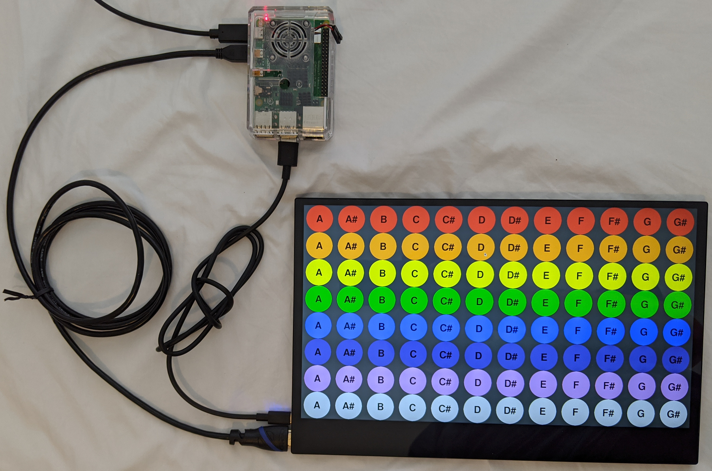
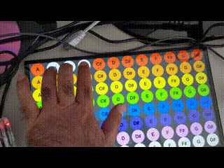

# Touch Screen Controller Gadgets

## Touch screen monitor requirements.

My requirements for a touch screen monitor to be used as a controller:

* Flat back so the monitor can lay flat on a table. Monitors with brackets on the back for a stand do not qualify. Cable connectors must be on the side.
* Small enough to be used on my lap.
* HDMI and USB connectors. No ribbon cables or soldering required to connect to a Raspberry Pi.
* Multi finger touch works with a Raspberry Pi running Raspbian.

One monitor that meets the requirements is the Virzen Portable Touchscreen
Monitor. Python3 with pygame 2.0.0-dev6 generates FINGERUP, FINGERDOWN, and
FINGERMOTION events from the touch controller. Touch gesture events are also
generated but I have not investigated further.

## Installing pygame 2.0.0-dev6

pygame 1.9 does not support the FINGERUP, FINGERDOWN, and FINGERMOTION events.

```
$ sudo apt install python3 python3-pip libsdl2-ttf-2.0-0
$ python3 -m pip install -U pygame==2.0.0.dev6 --user
```

## Touch screen MIDI buttons

```
$ python3 pygfullgrid.py
```



The touch screen monitor is shown in the lower right corner. The monitor is
powered by the Raspberry Pi 4 via USB. The touch data is sent from the monitor
over USB.

The top left red button labeled 'A' sends MIDI note 21. The red button to the
right labeled 'A#' sends MIDI note 22. Pressing a button sends MIDI note on and
releasing sends MIDI note off. Except for the bottom two rows. The bottom rows
are an experiment in implementing sticky keys. Pressing and releasing a button
sends MIDI note on. Pressing and releasing the same button send MIDI note off.
The program can be modified to send other MIDI messages such as Program Change
or Control Change. Or switch from MIDI to OSC or DMX.



The video shows multi touch in action and screen mirroring. The Raspberry Pi 4
supports two monitors so the big non-touch monitor is a mirror of the portable
monitor.

## Raspberry Pi 4 mirror two monitors

To enable screen mirroring, open the Screen Configuration window then drag
HDMI-2 so it overlays HDMI-1.
